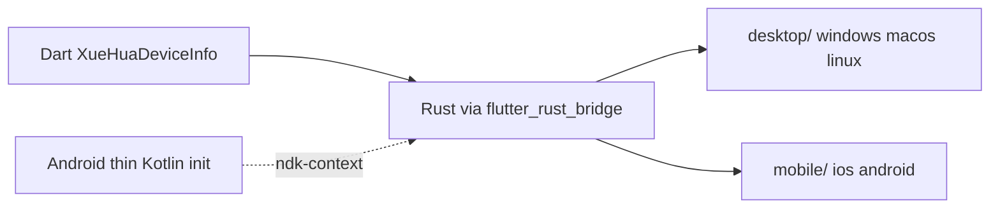

# xue_hua_device_info

**English** | [简体中文](README.zh-CN.md)

A Flutter plugin to access device information including battery, network, storage, display, and system details.

---

## Supported Platforms

| Platform | Support | Notes |
| -------- | -------------- | ------------ |
| Windows  | Yes | Rust + WMI |
| macOS    | Yes | Rust + system_profiler |
| Linux    | Yes | Rust + `/sys` / `xrandr` |
| iOS      | Yes | Rust + UIKit |
| Android  | Yes | Rust + JNI + thin Kotlin init (Cargokit) |
| Web      | **No** | Not supported |

---

## Installation

Add to your `pubspec.yaml`:

```yaml
dependencies:
  xue_hua_device_info: ^1.1.0
```

For local development:

```yaml
dependencies:
  xue_hua_device_info:
    path: ../xue_hua_device_info
```

---

## Quick Start

```dart
import 'package:flutter/widgets.dart';
import 'package:xue_hua_device_info/xue_hua_device_info.dart';

Future<void> main() async {
  // 1. Must initialize Flutter bindings first
  WidgetsFlutterBinding.ensureInitialized();

  // 2. Initialize native Rust library (all platforms, including Android)
  await XueHuaDeviceInfo.initialize();

  // 3. Call APIs to fetch device information
  final device  = await XueHuaDeviceInfo.getDeviceInfo();
  final battery = await XueHuaDeviceInfo.getBatteryInfo();
  final network = await XueHuaDeviceInfo.getNetworkInfo();
  final storage = await XueHuaDeviceInfo.getStorageInfo();
  final display = await XueHuaDeviceInfo.getDisplayInfo();

  print('Device: ${device.model}');
  print('Battery: ${battery.level}%');
  print('IP: ${network.ipAddress}');
  print('Storage: ${storage.freeSpace} bytes free');
  print('Display: ${display.width}x${display.height}');
}
```

### Parallel Calls

All APIs are `static Future<...>` and can be called in parallel:

```dart
final results = await Future.wait([
  XueHuaDeviceInfo.getDeviceInfo(),
  XueHuaDeviceInfo.getBatteryInfo(),
  XueHuaDeviceInfo.getNetworkInfo(),
  XueHuaDeviceInfo.getStorageInfo(),
  XueHuaDeviceInfo.getDisplayInfo(),
]);

final device  = results[0] as DeviceInfoResponse;
final battery = results[1] as BatteryInfo;
final network = results[2] as NetworkInfo;
final storage = results[3] as StorageInfo;
final display = results[4] as DisplayInfo;
```

### Initialization Notes

| Platform | `initialize()` behavior |
| --------------- | ------------------------------ |
| Android / iOS / Windows / macOS / Linux | Loads Rust FFI (`RustLib.init()`); Android also initializes `ndk-context` via a thin Kotlin plugin |
| Web | Not supported — `initialize()` throws `UnsupportedError` |

You **must** call `WidgetsFlutterBinding.ensureInitialized()` and `XueHuaDeviceInfo.initialize()` before any API call (except on Web).

---

## API Reference

| Method | Returns | Description |
| ------------- | ------------------ | ------------------ |
| `XueHuaDeviceInfo.initialize()` | `Future<void>` | Initialize native library |
| `XueHuaDeviceInfo.getDeviceInfo()` | `Future<DeviceInfoResponse>` | Device identity and hardware info |
| `XueHuaDeviceInfo.getBatteryInfo()` | `Future<BatteryInfo>` | Battery status |
| `XueHuaDeviceInfo.getNetworkInfo()` | `Future<NetworkInfo>` | Network connection details |
| `XueHuaDeviceInfo.getStorageInfo()` | `Future<StorageInfo>` | Primary storage capacity |
| `XueHuaDeviceInfo.getDisplayInfo()` | `Future<DisplayInfo>` | Primary display properties |

### Error Handling

| Platform | Exception | When |
| --------------- | -------------------- | --------------- |
| Android / Windows / macOS / Linux / iOS | `String` (via flutter_rust_bridge) | Rust collection failure |
| Web | `UnsupportedError` | Calling `initialize()` or any API |

Example:

```dart
try {
  final device = await XueHuaDeviceInfo.getDeviceInfo();
} on UnsupportedError catch (e) {
  // Web
  print('Unsupported: $e');
} catch (e) {
  // Rust platforms (including Android)
  print('Error: $e');
}
```

---

## Data Models

All models are exported from `package:xue_hua_device_info/xue_hua_device_info.dart`.

---

### `DeviceInfoResponse`

Device identification and hardware information. Useful for device fingerprinting, analytics, or user identification.

| Property | Type | Nullable | Description | Example |
| --------------- | ----------- | --------------- | ------------------ | -------------- |
| `uuid` | `String?` | Yes | Hardware UUID or unique device ID | `"12345678-1234-5678-9ABC-DEF012345678"` |
| `manufacturer` | `String?` | Yes | Manufacturer | `"Apple Inc."`, `"Dell Inc."`, `"samsung"` |
| `model` | `String?` | Yes | Device model | `"MacBook Pro"`, `"SM-G991B"`, `"iPhone15,2"` |
| `serial` | `String?` | Yes | Serial number (may be restricted) | `"C02ABC123"` |
| `androidId` | `String?` | Yes | Android device ID (**Android only**) | `"a1b2c3d4e5f67890"` |
| `deviceName` | `String?` | Yes | User-assigned device name or hostname | `"My MacBook"`, `"DESKTOP-ABC123"` |

**`uuid` source by platform:**

| Platform | Source |
| --------------- | ------------- |
| macOS           | `system_profiler` → `platform_UUID` |
| Windows         | WMI `Win32_ComputerSystemProduct.UUID` |
| Linux           | `/sys/class/dmi/id/product_uuid`, fallback `/etc/machine-id` |
| Android         | Same as `androidId` (`Settings.Secure.ANDROID_ID`) |
| iOS             | `UIDevice.identifierForVendor` |

**`serial` source by platform:**

| Platform | Source |
| --------------- | ------------- |
| macOS           | `system_profiler` → `serial_number` |
| Windows         | WMI `Win32_BIOS.SerialNumber`, fallback `IdentifyingNumber` |
| Linux           | `/sys/class/dmi/id/product_serial` |
| Android         | Falls back to `androidId` |
| iOS             | Keychain-persisted UUID (survives app reinstall) |

---

### `BatteryInfo`

Battery status and health information.

| Property | Type | Nullable | Description | Example |
| --------------- | ----------- | --------------- | ------------------ | -------------- |
| `level` | `double?` | Yes | Current charge level (0–100) | `85.0` |
| `isCharging` | `bool?` | Yes | Whether device is charging | `true` |
| `health` | `String?` | Yes | Battery health status | `"Good"`, `"95.0"` |

**Possible `health` values:**

| Platform | Values |
| --------------- | ----------- |
| Android         | `"Good"`, `"Overheat"`, `"Dead"`, `"Over Voltage"`, `"Unspecified Failure"`, `"Cold"`, `"Unknown"` |
| macOS           | `"Good"` (when battery detected) |
| iOS             | `"Unknown"`, `"Good"`, `"Good (Charging)"`, `"Good (Full)"` |
| Windows / Linux | Health percentage string, e.g. `"95.0"` |

> **Note:** Devices without a battery (e.g. desktops) may return all `null` or default values.

---

### `NetworkInfo`

Network connection details.

| Property | Type | Nullable | Description | Example |
| --------------- | ----------- | --------------- | ------------------ | -------------- |
| `ipAddress` | `String?` | Yes | Local IPv4 address | `"192.168.1.100"` |
| `networkType` | `String?` | Yes | Connection type | `"wifi"`, `"ethernet"`, `"cellular"` |
| `macAddress` | `String?` | Yes | MAC address | See platform notes below |

**Possible `networkType` values:**

| Value | Description |
| ---------- | ------------------ |
| `"wifi"` | Wi-Fi |
| `"ethernet"` | Wired Ethernet |
| `"cellular"` | Cellular |
| `"unknown"` | Unknown or unrecognized |
| `"no_connection"` | No connection (iOS) |
| `"other"` | Other type (iOS) |

**`macAddress` by platform:**

| Platform | Returns |
| --------------- | ---------------- |
| iOS             | `"unavailable"` (privacy restriction) |
| Android         | `"restricted"` (privacy restriction) |
| Windows / macOS / Linux | Real MAC address, or `null` |

> When offline, `ipAddress` may be `null` (Android / iOS).

---

### `StorageInfo`

Primary storage capacity and type information.

| Property | Type | Nullable | Description | Example |
| --------------- | ----------- | --------------- | ------------------ | -------------- |
| `totalSpace` | `BigInt` | No | Total capacity in bytes | `512000000000` |
| `freeSpace` | `BigInt` | No | Available space in bytes | `128000000000` |
| `storageType` | `String?` | Yes | Storage technology type | `"internal"`, `"Ssd"` |

> Uses `BigInt` instead of `int` to avoid overflow on large capacities.

**`storageType` by platform:**

| Platform | Values | Scope |
| --------------- | ----------- | ---------------- |
| Android         | `"internal"` | Internal data partition (`Environment.getDataDirectory()`) |
| iOS             | `"internal"` | User home volume |
| Windows / macOS / Linux | `"Ssd"`, `"Hdd"`, `"Unknown"`, etc. | System disk (`/` or `C:\`) |

**Format bytes example:**

```dart
String formatBytes(BigInt? bytes) {
  if (bytes == null) return '—';
  final gb = bytes.toDouble() / (1024 * 1024 * 1024);
  return '${gb.toStringAsFixed(2)} GB';
}
```

---

### `DisplayInfo`

Primary display properties.

| Property | Type | Nullable | Description | Example |
| --------------- | ----------- | --------------- | ------------------ | -------------- |
| `width` | `int` | No | Screen width in physical pixels | `2560` |
| `height` | `int` | No | Screen height in physical pixels | `1440` |
| `scaleFactor` | `double` | No | Display scale factor | `2.0` (Retina) |
| `refreshRate` | `double?` | Yes | Refresh rate in Hz | `60.0`, `120.0` |

**`scaleFactor` by platform:**

| Platform | Description |
| --------------- | ------------------ |
| macOS           | ~`2.0` on Retina (physical / logical pixels) |
| Windows         | System DPI / 96 (e.g. 150% scaling → `1.5`) |
| Android         | `DisplayMetrics.density` |
| iOS             | `UIScreen.scale` |
| Linux           | Default `1.0` (resolution via `xrandr`) |

> Variable refresh rate displays may return `null` for `refreshRate` on macOS.

---

## Platform Matrix

| Field | Windows | macOS | Linux | iOS | Android |
| ------------ | ------- | ----- | ----- | --- | ------- |
| `uuid` | WMI UUID | platform_UUID | DMI UUID / machine-id | identifierForVendor | ANDROID_ID |
| `androidId` | — | — | — | — | ANDROID_ID |
| `serial` | BIOS Serial | system_profiler | DMI serial | Keychain UUID | = androidId |
| `macAddress` | Real MAC | Real MAC | Real MAC | `"unavailable"` | `"restricted"` |
| `storageType` | Ssd/Hdd/… | Ssd/Hdd/… | Ssd/Hdd/… | `"internal"` | `"internal"` |
| `storage` scope | System drive C:\ | System drive / | System drive / | User home | Internal data partition |
| `display` source | GetSystemMetrics | CoreGraphics | xrandr | UIScreen | DisplayMetrics |
| Implementation | Rust | Rust | Rust | Rust | Rust + thin Kotlin init |

> Linux display info requires the `xrandr` command; Wayland-only environments may not return resolution.

---

## Architecture



| Layer | Description |
| ------------ | ------------------ |
| **Dart** | `XueHuaDeviceInfo` facade in `lib/src/device_info.dart` |
| **Android** | Thin Kotlin plugin (`loadLibrary` + `initAndroid`) + Rust JNI adapter (`rust/src/mobile/android.rs`) |
| **Desktop / iOS** | Rust + `flutter_rust_bridge` (`rust/src/desktop/`, `rust/src/mobile/ios.rs`) |
| **Build** | All platforms: [Cargokit](https://github.com/irondash/cargokit) bundles Rust; Android also requires NDK |

---
