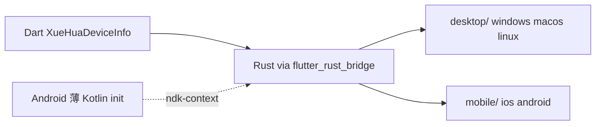

# xue_hua_device_info

[English](README.md) | **简体中文**

Flutter 插件，用于获取设备标识、电池、网络、存储和屏幕等信息。

---

## 支持平台

| 平台 | 支持 | 备注 |
| -------- | -------------- | ------------ |
| Windows  | 是 | Rust + WMI |
| macOS    | 是 | Rust + system_profiler |
| Linux    | 是 | Rust + `/sys` / `xrandr` |
| iOS      | 是 | Rust + UIKit |
| Android  | 是 | Rust + JNI + 薄 Kotlin init（Cargokit） |
| Web      | **否** | 不支持 |

---

## 安装

在 `pubspec.yaml` 中添加依赖：

```yaml
dependencies:
  xue_hua_device_info: ^1.1.0
```

本地开发可使用 path 依赖：

```yaml
dependencies:
  xue_hua_device_info:
    path: ../xue_hua_device_info
```

---

## 快速开始

```dart
import 'package:flutter/widgets.dart';
import 'package:xue_hua_device_info/xue_hua_device_info.dart';

Future<void> main() async {
  // 1. 必须先初始化 Flutter 绑定
  WidgetsFlutterBinding.ensureInitialized();

  // 2. 初始化原生 Rust 库（全平台统一，含 Android）
  await XueHuaDeviceInfo.initialize();

  // 3. 调用 API 获取设备信息
  final device  = await XueHuaDeviceInfo.getDeviceInfo();
  final battery = await XueHuaDeviceInfo.getBatteryInfo();
  final network = await XueHuaDeviceInfo.getNetworkInfo();
  final storage = await XueHuaDeviceInfo.getStorageInfo();
  final display = await XueHuaDeviceInfo.getDisplayInfo();

  print('Device: ${device.model}');
  print('Battery: ${battery.level}%');
  print('IP: ${network.ipAddress}');
  print('Storage: ${storage.freeSpace} bytes free');
  print('Display: ${display.width}x${display.height}');
}
```

### 并行调用

所有 API 均为 `static Future<...>`，可并行请求以提高性能：

```dart
final results = await Future.wait([
  XueHuaDeviceInfo.getDeviceInfo(),
  XueHuaDeviceInfo.getBatteryInfo(),
  XueHuaDeviceInfo.getNetworkInfo(),
  XueHuaDeviceInfo.getStorageInfo(),
  XueHuaDeviceInfo.getDisplayInfo(),
]);

final device  = results[0] as DeviceInfoResponse;
final battery = results[1] as BatteryInfo;
final network = results[2] as NetworkInfo;
final storage = results[3] as StorageInfo;
final display = results[4] as DisplayInfo;
```

### 初始化说明

| 平台 | `initialize()` 行为 |
| --------------- | ------------------------------ |
| Android / iOS / Windows / macOS / Linux | 加载 Rust FFI 库（`RustLib.init()`）；Android 另由薄 Kotlin plugin 初始化 `ndk-context` |
| Web | 不支持 — `initialize()` 抛出 `UnsupportedError` |

**必须**在调用任何 API 之前完成 `WidgetsFlutterBinding.ensureInitialized()` 和 `XueHuaDeviceInfo.initialize()`（Web 除外）。

---

## API 参考

| 方法 | 返回类型 | 说明 |
| ------------- | ------------------ | ------------------ |
| `XueHuaDeviceInfo.initialize()` | `Future<void>` | 初始化原生库 |
| `XueHuaDeviceInfo.getDeviceInfo()` | `Future<DeviceInfoResponse>` | 设备标识与硬件信息 |
| `XueHuaDeviceInfo.getBatteryInfo()` | `Future<BatteryInfo>` | 电池状态 |
| `XueHuaDeviceInfo.getNetworkInfo()` | `Future<NetworkInfo>` | 网络连接信息 |
| `XueHuaDeviceInfo.getStorageInfo()` | `Future<StorageInfo>` | 主存储容量 |
| `XueHuaDeviceInfo.getDisplayInfo()` | `Future<DisplayInfo>` | 主屏幕参数 |

### 错误处理

| 平台 | 异常类型 | 触发条件 |
| --------------- | -------------------- | --------------- |
| Android / Windows / macOS / Linux / iOS | `String`（经 flutter_rust_bridge 抛出） | Rust 层采集失败 |
| Web | `UnsupportedError` | 调用 `initialize()` 或任意 API |

示例：

```dart
try {
  final device = await XueHuaDeviceInfo.getDeviceInfo();
} on UnsupportedError catch (e) {
  // Web
  print('Unsupported: $e');
} catch (e) {
  // Rust 平台（含 Android）
  print('Error: $e');
}
```

---

## 返回对象

以下模型均从 `package:xue_hua_device_info/xue_hua_device_info.dart` 导出。

---

### `DeviceInfoResponse`

设备标识与硬件信息。可用于设备指纹、分析或用户识别。

| 属性 | 类型 | 可空 | 说明 | 示例 |
| --------------- | ----------- | --------------- | ------------------ | -------------- |
| `uuid` | `String?` | 是 | 硬件 UUID 或设备唯一标识 | `"12345678-1234-5678-9ABC-DEF012345678"` |
| `manufacturer` | `String?` | 是 | 制造商 | `"Apple Inc."`, `"Dell Inc."`, `"samsung"` |
| `model` | `String?` | 是 | 设备型号 | `"MacBook Pro"`, `"SM-G991B"`, `"iPhone15,2"` |
| `serial` | `String?` | 是 | 序列号（部分平台受限） | `"C02ABC123"` |
| `androidId` | `String?` | 是 | Android 设备 ID（**仅 Android**） | `"a1b2c3d4e5f67890"` |
| `deviceName` | `String?` | 是 | 用户设备名或主机名 | `"My MacBook"`, `"DESKTOP-ABC123"` |

**各平台 `uuid` 来源：**

| 平台 | 来源 |
| --------------- | ------------- |
| macOS           | `system_profiler` → `platform_UUID` |
| Windows         | WMI `Win32_ComputerSystemProduct.UUID` |
| Linux           | `/sys/class/dmi/id/product_uuid`，回退 `/etc/machine-id` |
| Android         | 同 `androidId`（`Settings.Secure.ANDROID_ID`） |
| iOS             | `UIDevice.identifierForVendor` |

**各平台 `serial` 来源：**

| 平台 | 来源 |
| --------------- | ------------- |
| macOS           | `system_profiler` → `serial_number` |
| Windows         | WMI `Win32_BIOS.SerialNumber`，回退 `IdentifyingNumber` |
| Linux           | `/sys/class/dmi/id/product_serial` |
| Android         | 回退为 `androidId` |
| iOS             | Keychain 持久化 UUID（应用卸载重装后保持不变） |

---

### `BatteryInfo`

电池状态与健康信息。

| 属性 | 类型 | 可空 | 说明 | 示例 |
| --------------- | ----------- | --------------- | ------------------ | -------------- |
| `level` | `double?` | 是 | 当前电量百分比（0–100） | `85.0` |
| `isCharging` | `bool?` | 是 | 是否正在充电 | `true` |
| `health` | `String?` | 是 | 电池健康状态 | `"Good"`, `"95.0"` |

**`health` 可能值：**

| 平台 | 值 |
| --------------- | ----------- |
| Android         | `"Good"`, `"Overheat"`, `"Dead"`, `"Over Voltage"`, `"Unspecified Failure"`, `"Cold"`, `"Unknown"` |
| macOS           | `"Good"`（若检测到电池） |
| iOS             | `"Unknown"`, `"Good"`, `"Good (Charging)"`, `"Good (Full)"` |
| Windows / Linux | 健康度百分比字符串，如 `"95.0"` |

> **注意：** 无电池设备（如台式机）可能返回全 `null` 或默认值。

---

### `NetworkInfo`

网络连接详情。

| 属性 | 类型 | 可空 | 说明 | 示例 |
| --------------- | ----------- | --------------- | ------------------ | -------------- |
| `ipAddress` | `String?` | 是 | 本地 IPv4 地址 | `"192.168.1.100"` |
| `networkType` | `String?` | 是 | 连接类型 | `"wifi"`, `"ethernet"`, `"cellular"` |
| `macAddress` | `String?` | 是 | MAC 地址 | 见下方平台说明 |

**`networkType` 可能值：**

| 值 | 说明 |
| ---------- | ------------------ |
| `"wifi"` | Wi-Fi 连接 |
| `"ethernet"` | 有线以太网 |
| `"cellular"` | 蜂窝移动网络 |
| `"unknown"` | 未知或未识别 |
| `"no_connection"` | 无连接（iOS） |
| `"other"` | 其他类型（iOS） |

**`macAddress` 平台说明：**

| 平台 | 返回值 |
| --------------- | ---------------- |
| iOS             | `"unavailable"`（隐私限制） |
| Android         | `"restricted"`（隐私限制） |
| Windows / macOS / Linux | 真实 MAC 地址，或 `null` |

> 无网络时 `ipAddress` 可能为 `null`（Android / iOS）。

---

### `StorageInfo`

主存储容量与类型信息。

| 属性 | 类型 | 可空 | 说明 | 示例 |
| --------------- | ----------- | --------------- | ------------------ | -------------- |
| `totalSpace` | `BigInt` | 否 | 总容量（字节） | `512000000000` |
| `freeSpace` | `BigInt` | 否 | 可用空间（字节） | `128000000000` |
| `storageType` | `String?` | 是 | 存储类型 | `"internal"`, `"Ssd"` |

> 使用 `BigInt` 而非 `int`，避免大容量存储溢出。

**`storageType` 平台说明：**

| 平台 | 值 | 统计范围 |
| --------------- | ----------- | ---------------- |
| Android         | `"internal"` | 内部数据分区（`Environment.getDataDirectory()`） |
| iOS             | `"internal"` | 用户主目录卷 |
| Windows / macOS / Linux | `"Ssd"`, `"Hdd"`, `"Unknown"` 等 | 系统盘（`/` 或 `C:\`） |

**字节格式化示例：**

```dart
String formatBytes(BigInt? bytes) {
  if (bytes == null) return '—';
  final gb = bytes.toDouble() / (1024 * 1024 * 1024);
  return '${gb.toStringAsFixed(2)} GB';
}
```

---

### `DisplayInfo`

主屏幕属性。

| 属性 | 类型 | 可空 | 说明 | 示例 |
| --------------- | ----------- | --------------- | ------------------ | -------------- |
| `width` | `int` | 否 | 屏幕宽度（物理像素） | `2560` |
| `height` | `int` | 否 | 屏幕高度（物理像素） | `1440` |
| `scaleFactor` | `double` | 否 | 缩放因子 | `2.0`（Retina） |
| `refreshRate` | `double?` | 是 | 刷新率（Hz） | `60.0`, `120.0` |

**`scaleFactor` 平台说明：**

| 平台 | 说明 |
| --------------- | ------------------ |
| macOS           | Retina 屏幕约 `2.0`（物理像素 / 逻辑像素） |
| Windows         | 系统 DPI / 96（如 150% 缩放 → `1.5`） |
| Android         | `DisplayMetrics.density` |
| iOS             | `UIScreen.scale` |
| Linux           | 默认 `1.0`（依赖 `xrandr` 获取分辨率） |

> 可变刷新率屏幕（如 ProMotion）在 macOS 上 `refreshRate` 可能为 `null`。

---

## 平台差异速查表

| 字段 | Windows | macOS | Linux | iOS | Android |
| ------------ | ------- | ----- | ----- | --- | ------- |
| `uuid` | WMI UUID | platform_UUID | DMI UUID / machine-id | identifierForVendor | ANDROID_ID |
| `androidId` | — | — | — | — | ANDROID_ID |
| `serial` | BIOS Serial | system_profiler | DMI serial | Keychain UUID | = androidId |
| `macAddress` | 真实 MAC | 真实 MAC | 真实 MAC | `"unavailable"` | `"restricted"` |
| `storageType` | Ssd/Hdd/… | Ssd/Hdd/… | Ssd/Hdd/… | `"internal"` | `"internal"` |
| `storage` 范围 | 系统盘 C:\ | 系统盘 / | 系统盘 / | 用户主目录 | 内部数据分区 |
| `display` 来源 | GetSystemMetrics | CoreGraphics | xrandr | UIScreen | DisplayMetrics |
| 实现语言 | Rust | Rust | Rust | Rust | Rust + 薄 Kotlin init |

> Linux 屏幕信息依赖 `xrandr` 命令，Wayland-only 环境可能无法获取分辨率。

---

## 架构



| 层级 | 说明 |
| ------------ | ------------------ |
| **Dart** | `XueHuaDeviceInfo` 门面，位于 `lib/src/device_info.dart` |
| **Android** | 薄 Kotlin plugin（`loadLibrary` + `initAndroid`）+ Rust JNI adapter（`rust/src/mobile/android.rs`） |
| **Desktop / iOS** | Rust + `flutter_rust_bridge`（`rust/src/desktop/`, `rust/src/mobile/ios.rs`） |
| **构建** | 全平台：[Cargokit](https://github.com/irondash/cargokit) 打包 Rust 库；Android 另需 NDK |

---
